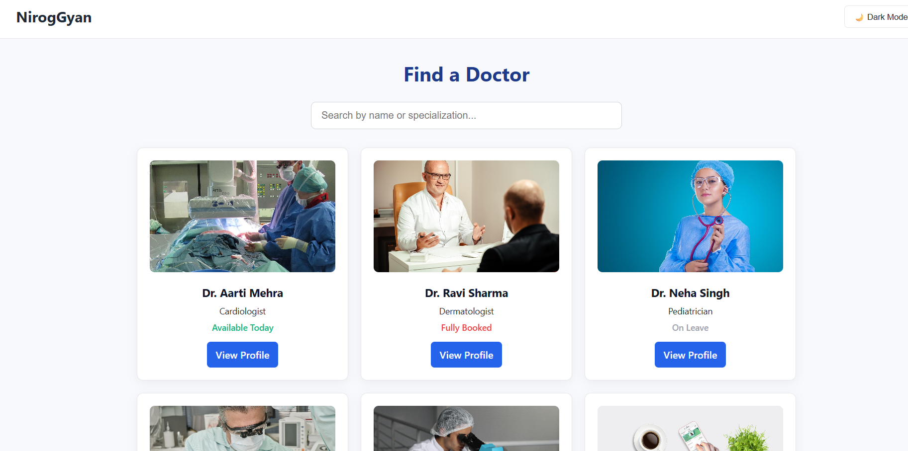
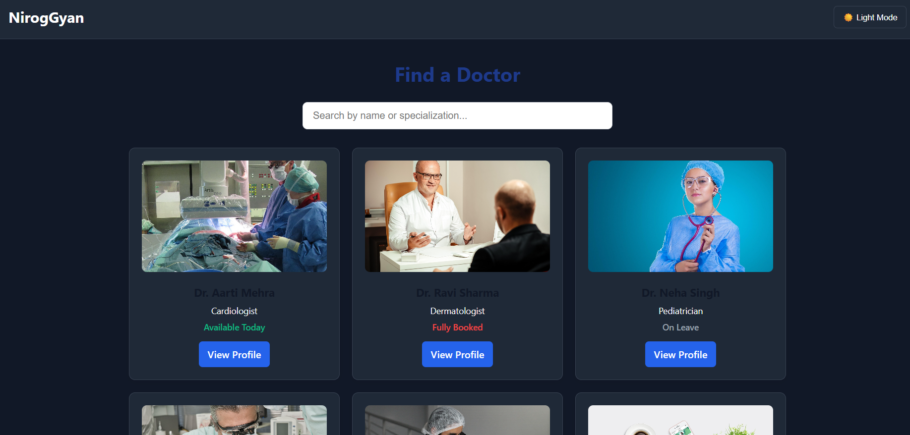
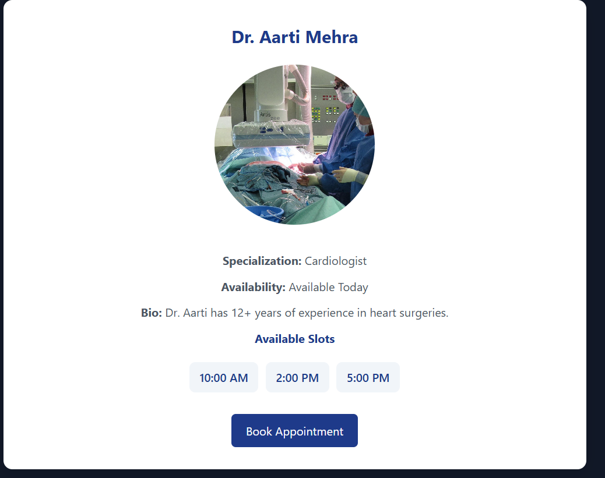
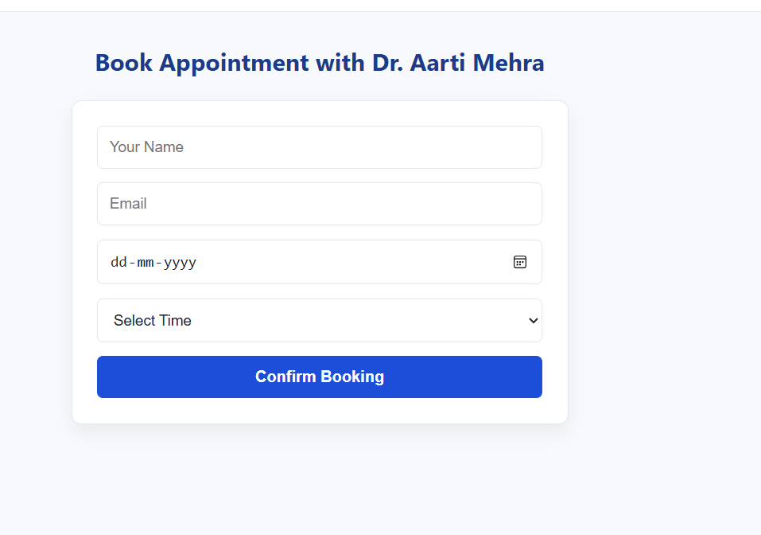

# 🩺 NirogGyan - Healthcare Appointment Booking App

This is a responsive React-based web application that allows users to view doctor profiles, check their availability, and book appointments with them in a clean and intuitive interface.

## 🚀 Live Demo (if hosted)

> Coming soon...

## 📂 GitHub Repository

> 🔗 [GitHub Repo Link Here](https://github.com/yourusername/nirog-gyan-booking-app)  
*(Replace with your actual public repository URL)*

---

## 🛠 Tools & Libraries Used

| Technology         | Purpose                                             |
|--------------------|-----------------------------------------------------|
| **React JS**       | UI Development                                      |
| **React Router**   | Routing between pages                               |
| **JavaScript (ES6+)** | Functional logic                                 |
| **CSS**            | Custom styling, Light/Dark themes                   |
| **LocalStorage**   | Theme persistence                                   |
| **JSON (Mock Data)**| Simulated backend API responses                     |

> ⚠️ TypeScript and backend integration with Node.js/Express were optional and hence not used for simplicity.

---

## 📸 Screenshots

Click to view

- 🏠 **Home Page (Light Mode):**  
  View list of doctors with filters and availability tags.

- 👤 **Doctor Profile Page:**  
  Detailed view with availability, description, and book button.

- 📝 **Booking Form:**  
  Form for patient name, email, date/time, and confirmation.

- 🌙 **Dark Mode:**  
  Toggle between light and dark themes (persisted).

---

## ✨ Features

- Responsive layout using pure CSS Grid and Flexbox
- View doctors by name, specialization, and availability
- Doctor profile with time slots and bio
- Booking form with validation
- Success message with 10-second countdown redirect
- Light/Dark mode toggle with persistent user preference

---

## ⏳ Improvements With More Time

If given more time, here’s what I would add:

1. ✅ **Backend Integration**  
   - Use Express.js + MongoDB or SQLite to store doctor data and bookings.
   - Implement authentication and protected routes for admin users.

2. ✅ **Search & Filters**  
   - Better filtering using real-time fuzzy search (e.g., Fuse.js).
   - Add sorting by availability or specialization.

3. ✅ **Pagination & Lazy Loading**  
   - Handle long lists of doctors with pagination or infinite scroll.

4. ✅ **Better UI/UX**  
   - Use Tailwind CSS or Material UI for faster, scalable design.
   - Add transition animations for modals, cards, and feedback messages.

5. ✅ **Form Enhancements**  
   - Add proper validations, error messages, and form reset logic.
   - Integrate calendar/time-picker components.

6. ✅ **Deploy to Vercel or Netlify**  
   - Host app and use GitHub Actions for CI/CD.

---

## 🧩 Challenges Faced & Solutions

| Challenge | Solution |
|----------|----------|
| **State Management Across Routes** | Used `useParams` and `fetch` to dynamically get doctor data based on URL ID. |
| **Dark Mode Switching** | Used CSS variables and `data-theme` attributes to handle theme styles cleanly. Persisted selection with `localStorage`. |
| **Countdown Redirect after Booking** | Used `useEffect` + `setTimeout` to show success and then redirect user smoothly after 10 seconds. |
| **Responsive Layout with CSS Only** | Avoided external libraries by using native CSS Grid and Flexbox to make the layout mobile-friendly. |
| **Mock API Handling** | Used static JSON to simulate real API without needing a backend for this assignment. |

---

## 📁 Folder Structure

# React + Vite

This template provides a minimal setup to get React working in Vite with HMR and some ESLint rules.

Currently, two official plugins are available:

- [@vitejs/plugin-react](https://github.com/vitejs/vite-plugin-react/blob/main/packages/plugin-react/README.md) uses [Babel](https://babeljs.io/) for Fast Refresh
- [@vitejs/plugin-react-swc](https://github.com/vitejs/vite-plugin-react-swc) uses [SWC](https://swc.rs/) for Fast Refresh

## Expanding the ESLint configuration

If you are developing a production application, we recommend using TypeScript and enable type-aware lint rules. Check out the [TS template](https://github.com/vitejs/vite/tree/main/packages/create-vite/template-react-ts) to integrate TypeScript and [`typescript-eslint`](https://typescript-eslint.io) in your project.
